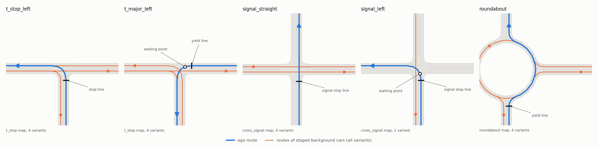

# Semantic alphabets for automata-guided driving

A research prototype, built on the [SMARTS](https://github.com/huawei-noah/SMARTS) driving
simulator, for finding and testing a small set of **semantic labels** that describe what
is going on at a road junction: `at_entry_line`, `stop_sign`, `ego_has_priority`,
`gap_safe`, and so on.

The labels are meant to become the alphabet of an automaton (DFA / reward machine) that
guides a driving policy. The alphabet describes the world; the automaton and the policy
decide what to do. This repository covers the first part: choosing the labels and
checking, frame by frame, that they change when a human driver's reasoning would change.

**Status (2026-10-04): Checkpoint 3.** Four junction scenarios, 26 recorded runs, 19
labels, and a frame-by-frame inspector work end to end. The label sequences agree with the
hand-written expectations in 23 of 26 runs. The label set and its thresholds are under
review. No policy is trained.

To look at results without installing anything, open
[docs/inspector.html](docs/inspector.html) in a browser (a snapshot of all 26 runs).

## Contents

1. [How it works](#1-how-it-works)
2. [Requirements](#2-requirements)
3. [Setup, step by step](#3-setup-step-by-step)
4. [Running the pipeline](#4-running-the-pipeline)
5. [Looking at the results](#5-looking-at-the-results)
6. [The labels](#6-the-labels)
7. [Scenarios and drivers](#7-scenarios-and-drivers)
8. [Changing things](#8-changing-things)
9. [Project structure](#9-project-structure)
10. [Known limits](#10-known-limits)
11. [Further reading](#11-further-reading)

## 1. How it works

```
 maps + scenario catalog
          |
          v
 1. SIMULATE      SMARTS + SUMO drive each scenario once          -> outputs/runs/*.json
          |       (one raw snapshot of the world per 0.1 s)
          v
 2. LABEL         19 labeling functions run on every snapshot     -> outputs/traces/*.txt
          |       and the result is compared with the expected
          |       label sequence written by hand for that run
          v
 3. INSPECT       one web page to step through any run            -> outputs/inspector.html
```

Three ideas hold it together:

- **Simulate once, label many times.** Step 1 really runs the simulator: the cars are
  driven live by SUMO's driver model or by a script, and every frame is recorded. Steps 2
  and 3 only read those recordings. Changing a label or a threshold therefore takes
  seconds, not a new simulation. The scenarios are staged (fixed routes, fixed departure
  times, no randomness), so a re-simulation reproduces the same run.
- **A label is a fact about one frame.** Each labeling function looks at a single snapshot
  (where every car is, how fast, which way it faces, what the signals show) plus the
  static map, and answers true or false. It has no memory of earlier frames. Anything that
  needs memory, such as "I already stopped at the line", is left to the automaton.
- **Expectations come first.** For every run there is a hand-written sequence of phases
  ("held at the stop line", "free to go", "crossing"), each listing which labels must be
  on or off. They were written before the labeling code, so comparing the two is a test of
  the labels and not a description of them.

Nothing here learns. There is no reinforcement learning and no trained policy yet.

## 2. Requirements

| Need | Notes |
|---|---|
| Windows 10 or 11, 64-bit | Developed and tested on Windows 11. Linux should work and needs no patch, but is untested here. |
| Python 3.10, 64-bit | SMARTS 2.0.1 supports Python 3.8 to 3.11. Check with `py -3.10 --version`. Install from python.org if missing. |
| Microsoft C++ Build Tools | One dependency (pybullet) has no ready-made Windows package and is compiled during install. Get "Build Tools for Visual Studio" from visualstudio.microsoft.com and select the workload **Desktop development with C++**. |
| Git | To clone the repository. |
| About 3 GB of free disk space | Mostly the Python environment. |

No GPU is needed.

## 3. Setup, step by step

All commands are run in a terminal (PowerShell or Command Prompt) opened in the project
folder.

**Step 1. Get the code.**

    git clone <repository-url> Multi_Agent_Auto_Drive
    cd Multi_Agent_Auto_Drive

**Step 2. Create a Python environment inside the project.**

    py -3.10 -m venv .venv

This creates the folder `.venv`. Every later command uses `.venv\Scripts\python`, so
nothing needs to be "activated".

**Step 3. Install the packages.**

    .venv\Scripts\python -m pip install --upgrade pip
    .venv\Scripts\python -m pip install -r requirements.txt

This takes about 10 minutes. Most of that is the line
`Building wheel for pybullet ... still running`, which is the compile step; it prints
nothing for several minutes. It ends with `Successfully installed ... smarts-2.0.1 ...`.

`requirements.txt` names the two top-level packages (SMARTS with its SUMO, Envision and
Gymnasium extras, and matplotlib). `requirements.lock.txt` lists the exact versions of
everything that was installed when this was last tested. To reproduce that environment
exactly, install from the lock file instead.

**Step 4. Patch SMARTS for Windows.**

    .venv\Scripts\python scripts\patch_smarts_windows.py

Expected output:

    patched:         core/utils/core_logging.py
    patched:         core/utils/resources.py

SMARTS officially supports only Linux and macOS. This script replaces two small
Unix-only snippets inside the installed SMARTS package. It is safe to run twice (it then
prints `already patched`), and must be run again after SMARTS is reinstalled. Skip this
step on Linux.

**Step 5. Check that the simulator works.**

    .venv\Scripts\python -m semalpha.run t_stop_left clear

This builds one map, simulates one small scenario with two different drivers (about 20
seconds), and should print two lines like:

    t_stop_left     clear                 sumo              t=0.1-18.6s | enters 10.1s, clear 13.6s | stops: 9.8-9.9s (0.1 m before line) | closest: none
    t_stop_left     clear                 roll_through      t=0.2-20.9s | enters 9.7s, clear 12.6s | stops: none | closest: none | events: ['reached_goal']

Lines saying `Success.` and a `UserWarning` about `moveToXY` are normal.

### If something goes wrong

| Symptom | Cause and fix |
|---|---|
| `error: Microsoft Visual C++ 14.0 or greater is required` during install | The C++ Build Tools are missing. Install them (section 2) and repeat step 3. |
| Install errors, and `.venv\Scripts\python --version` does not say 3.10 | The environment was made with another Python. Delete `.venv` and repeat from step 2. |
| `TypeError: argument of type 'NoneType' is not iterable`, with `ctypes.CDLL(None)` in the traceback | Step 4 was skipped. Run the patch script. |
| `PermissionError ... smarts\assets\vehicles\tmp....py` | Same: run the patch script. |
| The patch script prints `NOT APPLIED (source differs from SMARTS 2.0.1)` | A different SMARTS version is installed. Install the version in `requirements.txt`. |
| `KeyError` mentioning a scenario, variant and driver when running step 2 of the pipeline | A run was added to the catalog without an entry in `semalpha/expected.py` (section 8). |
| `FileNotFoundError ... outputs\runs\...json` | That run has not been simulated yet. Run pipeline step 1. |

## 4. Running the pipeline

### Step 1: simulate and record (about 5 minutes)

    .venv\Scripts\python -m semalpha.run

Compiles the maps, then simulates every scenario variant with every driver: 26 runs. Each
run is saved as `outputs/runs/<scenario>/<variant>__<driver>.json` and summarised in one
line of raw facts (when the ego enters and clears the junction, when it is stationary,
how close it comes to another car, the signal sequence, simulator events). These lines
contain no labels; they are for checking that a scenario stages what it claims.

Repeat this step only after changing a map, a scenario or a driver. To simulate less:

    .venv\Scripts\python -m semalpha.run t_stop_left                      # one scenario
    .venv\Scripts\python -m semalpha.run t_stop_left wait_for_gap         # one variant, all its drivers
    .venv\Scripts\python -m semalpha.run t_stop_left wait_for_gap sumo    # one run

### Step 2: label and compare (a few seconds)

    .venv\Scripts\python -m semalpha.label

Computes all 19 labels for every frame of every recorded run, writes each label sequence
to `outputs/traces/<scenario>/<variant>__<driver>.txt`, and prints one verdict per run:

    match    t_stop_left     wait_for_gap          sumo                milestones 6/6
    match*   signal_straight yellow_far            sumo                milestones 8/8, unexplained 2.0s
    ...
    23 match, 3 match*

| Verdict | Meaning |
|---|---|
| `match` | Every expected phase was reached in order, every frame fits the current or next phase, and no forbidden combination occurred. |
| `match*` | Every expected phase was reached, but for some stretch the labels fit neither the current nor the next phase. Worth a look. |
| `MISMATCH` | An expected phase was never reached, or a combination listed as "never" occurred. |

Useful variations:

    .venv\Scripts\python -m semalpha.label t_stop_left wait_for_gap sumo   # print expected phases and the label sequence
    .venv\Scripts\python -m semalpha.label --trace                         # print them for every run
    .venv\Scripts\python -m semalpha.label --stats                         # per label: share of time true, changes, flickers
    .venv\Scripts\python -m semalpha.label --set gap_margin_s=3            # try a threshold without editing any file

### Step 3: build the inspector (a few seconds)

    .venv\Scripts\python -m semalpha.inspector

Writes `outputs/inspector.html`, one self-contained page with all runs. Open it by
double-clicking it, or:

    start outputs\inspector.html

To refresh the snapshot that is kept in the repository:

    .venv\Scripts\python -m semalpha.inspector docs\inspector.html

### Optional: figures

    .venv\Scripts\python -m semalpha.plot

Writes `docs/figures/scenarios.png` (the maps and routes) and `docs/figures/traces.png`
(label timelines of six representative runs).

## 5. Looking at the results

### The inspector

- **Dropdown at the top**: choose a run. `✓` matches the expectation, `≈` matches with an
  unexplained stretch, `✗` differs.
- **Map**: the junction from above. The ego is blue, other cars orange, the entry line is
  the short dark bar across the ego's lane, the dashed line is the ego's route.
- **Left / Right arrow**: one frame back or forward. **Shift + arrow**: jump to the
  previous or next frame where any label changes. **Space**: play or pause.
- **Now**: the ego's speed and its distance to the entry line.
- **Labels**: all 19, the ones that are on shown in bold.
- **Cars whose path may meet the ego's**: for each such car and each way it might be
  going, its distance from the ego's path, its speed, who outranks whom, and whether the
  gap is sufficient. This is the reasoning behind `conflict_present`, `ego_has_priority`
  and `gap_safe` at that moment.
- **Expected sequence**: the phases written for this run and when each was reached.
- **Timeline at the bottom**: one row per label, a bar wherever it is on. Numbered lines
  mark the expected phases; shaded bands are unexplained stretches. Click or drag to jump.

### A label sequence as text

`.venv\Scripts\python -m semalpha.label t_stop_left wait_for_gap sumo` prints the full
set of labels at the start and then only what changes:

      0.1-  2.8s  ego_has_priority gap_safe others_can_yield exit_clear can_stop_before_entry
      2.9-  6.0s  +approaching_junction +stop_sign
      6.1-  7.4s  +conflict_present -ego_has_priority
      ...
      9.8- 12.7s  +ego_stopped
     14.9- 15.0s  +gap_safe
     15.3- 16.7s  +in_junction +in_waiting_area +ego_has_priority -at_entry_line -conflict_present ...

`+name` means the label turned on at the start of that stretch, `-name` that it turned off.

### Watching a simulation live (optional)

SMARTS ships its own 3D viewer, Envision. Start it in one terminal, open
http://localhost:8081 in a browser, and add `--envision` to a run command in a second
terminal:

    .venv\Scripts\scl envision start
    .venv\Scripts\python -m semalpha.run t_stop_left wait_for_gap sumo --envision

Envision shows the cars but not the labels.

## 6. The labels

Each label is one short function in `semalpha/predicates.py`. For every frame the labeler
builds a `View` of that frame (`semalpha/relations.py`) and calls all 19 functions on it.

| Group | Label | True when |
|---|---|---|
| Progress | `approaching_junction` | the junction's entry line is within 50 m ahead and not yet reached |
| | `at_entry_line` | the ego's front bumper is within 2 m before the stop / yield / signal line |
| | `in_junction` | the ego's front is past the entry line and its rear has not left the junction |
| | `in_waiting_area` | the ego is inside but not yet on road shared with any movement that may currently move |
| Control | `stop_sign` | the ego's movement through this junction is stop-controlled |
| | `signal_go`, `signal_caution`, `signal_stop` | the signal aspect facing the ego |
| Interaction | `conflict_present` | some car's possible path meets the ego's remaining path, and neither has passed that place |
| | `ego_has_priority` | the rules give the ego right of way over every such car |
| | `gap_safe` | going now, the ego and every such car would use the shared road at least 2 s apart |
| | `others_can_yield` | every car that owes the ego priority can still stop short of the ego's path |
| Occupancy | `path_blocked` | a car is physically on the ego's path inside the junction |
| | `exit_clear` | there is room beyond the junction for the ego to leave it completely |
| Ego motion | `ego_stopped` | the ego's speed is below 0.1 m/s |
| | `can_stop_before_entry` | braking at 3 m/s², the ego can still halt before the entry line |
| Terminal | `collision`, `off_road`, `goal_reached` | simulator event, or the geometric equivalent |

Three rules shape them:

- A label states a fact, never a decision. There is no `should_go` or `must_yield`.
- Other cars are judged only from what is visible: position, heading, speed, size. Their
  routes are unknown, so a car that could still go several ways is treated as possibly
  going any of them. A car approaching from the left counts as a possible conflict until
  it visibly turns off.
- Every number (50 m, 2 m, 2 s, 3 m/s², ...) is in `semalpha/thresholds.yaml`.

The code is layered so that the labels themselves stay short:

| Layer | File | Contains |
|---|---|---|
| 1. Helpers | `helpers.py`, `mapinfo.py` | distances, travel times, vehicle outlines, lane geometry, the map's right-of-way table |
| 2. Relations | `relations.py` | facts about the ego and one junction or one other car, e.g. "this car's possible path meets mine", "I outrank it", "the gap to it is safe" |
| 3. Labels | `predicates.py` | the 19 true/false facts, mostly one line each, built from layer 2 |

Example: `gap_safe` is `all(v.gap_safe(c) for c in v.conflicts)`. Layer 2 finds the
conflicts (which cars, which of their possible paths, where the paths meet) and judges
each gap; layer 1 supplies the distances and travel times.

Definitions, evidence from the runs, and open questions are in
[docs/vocabulary.md](docs/vocabulary.md).

## 7. Scenarios and drivers



| Scenario | Map | What the ego does | Variants |
|---|---|---|---|
| `t_stop_left` | `t_stop` | left turn out of a side road with a STOP sign | clear, wait_for_gap, gap_closes, other_turns_off |
| `t_major_left` | `t_stop` | left turn from the main road across oncoming traffic | clear, oncoming_then_gap, minor_car_waiting, oncoming_turns_right |
| `signal_straight` | `cross_signal` | straight through a signalized four-way junction | green, red_then_green, yellow_far, yellow_near |
| `signal_left` | `cross_signal` | left turn on a permissive green | oncoming_then_gap |
| `roundabout` | `roundabout` | enter a single-lane roundabout, leave at the second exit | empty, yield_to_circulating, circulating_exits, entering_car_yields |

A *variant* stages one decision branch with a few background cars, each with a fixed route
and departure time. Every variant is driven by:

- **`sumo`**: SUMO's own driver model drives the ego. It obeys signs, signals and right of
  way, so it serves as the rule-following reference. Note that it knows every other car's
  route, which the labels do not.
- **scripted drivers** (only where listed): the ego follows a fixed speed script and
  ignores traffic. These stage what a rule-follower never does: rolling through a stop
  sign, pulling out too early, running a red light, waiting needlessly.

The step-by-step description of what a human driver notices in each variant is in
[docs/traces.md](docs/traces.md).

## 8. Changing things

After any change below, run pipeline step 2 and step 3 again. Step 1 is needed only where
noted.

### Change a threshold

Edit the value in `semalpha/thresholds.yaml`. To try a value first without editing:

    .venv\Scripts\python -m semalpha.label --set comfortable_decel=4.5

### Add or remove a label

Add a function to `semalpha/predicates.py`:

```python
@proposition("ego motion")
def ego_fast(v: View) -> bool:
    """The ego is driving faster than the 'fast' threshold."""
    return v.ego.speed > v.th.fast_speed
```

and its number to `semalpha/thresholds.yaml` (`fast_speed: 10.0`). The label then appears
in every trace, in the statistics and in the inspector. To remove a label, delete its
function; if an expectation in `expected.py` mentions it, remove it there too. The
inspector supports at most 31 labels.

### Add a scenario variant (needs step 1 for the new runs)

1. Add a `Variant` to a scenario in `semalpha/scenarios.py`:

   ```python
   Variant(
       "late_car",
       "A third car arrives after the ego has started to move.",
       cars=(Car("east_1", ("WJ", "JE"), depart=6), Car("east_2", ("WJ", "JE"), depart=12)),
       scripts={"hesitant": Script("Waits five seconds longer than needed.",
                                   holds=(Hold("entry", until=20.0),))},
   ),
   ```

   A `Car` is given by its route (edge names, first to last) and departure time. A
   `Script` is a cruising speed plus optional `Hold`s: stop at the entry line or the
   in-junction waiting point until a given time.
2. Add one entry per driver to `EXPECTED` in `semalpha/expected.py`, keyed by
   `(scenario, variant, driver)`. Write it before looking at the labels.
3. Simulate it: `.venv\Scripts\python -m semalpha.run <scenario> late_car`, and check the
   printed raw facts to see that the staging does what you intended.

### Add a map (needs step 1)

Create `semalpha/maps/<name>/` with `map.nod.xml` (junction positions and types),
`map.edg.xml` (roads between them) and `map.netccfg` (options for SUMO's `netconvert`).
The three existing maps are short examples. Print what SUMO made of it, including who
gives way to whom, with:

    .venv\Scripts\python -m semalpha.mapinfo <name>

## 9. Project structure

```
semalpha/                  the Python package (the name is a placeholder)
  maps/<name>/             map sources: nodes, edges, netconvert options
  scenarios.py             catalog: scenarios, variants, staged cars, scripted drivers
  drivers.py               the scripted speed-only ego driver
  build.py                 compiles maps and writes SMARTS scenario folders
  run.py                   step 1: simulate, record, print raw facts
  record.py                the recording format: one world snapshot per step
  mapinfo.py               reads a map: movements, signs and signals, right of way, routes
  helpers.py               layer 1: geometry and kinematics helpers
  relations.py             layer 2: relational facts for one frame
  predicates.py            layer 3: the 19 labels
  thresholds.yaml          every tunable number
  expected.py              the expected label sequence of every run
  label.py                 step 2: label, compare, statistics
  inspector.py             step 3: builds the inspector page
  inspector.html           the inspector's page template
  plot.py                  figures
docs/
  traces.md                what a human driver notices in each scenario
  vocabulary.md            the labels: definitions, evidence, open points
  design_log.md            decisions and the reasons for them
  inspector.html           snapshot of the inspector for all 26 runs
  figures/                 scenarios.png, traces.png
scripts/
  patch_smarts_windows.py  makes SMARTS 2.0.1 run on Windows
  probe_smarts.py          prints everything SMARTS exposes for one small junction
scenarios/probe_t_stop/    the small junction used by probe_smarts.py
requirements.txt           what to install
requirements.lock.txt      exact versions last tested
```

Created when you run things, and not stored in the repository:

```
.venv/                     the Python environment
build/                     compiled maps and SMARTS scenario folders
outputs/runs/              recorded runs
outputs/traces/            label sequences
outputs/inspector.html     the inspector page
```

## 10. Known limits

- **Perfect perception.** The labels see every car's exact position and speed, with no
  noise, no blind spots and no range limit. They do not see where a car is going.
- **Not validated by a policy.** The labels have been checked against hand-written
  expectations on 26 staged runs. No automaton or learned policy has used them yet.
- **Three labels are untested.** `others_can_yield`, `exit_clear` and `off_road` never
  change value in any run so far.
- **One lane per direction.** Lane changes, queues and a car ahead in the ego's lane are
  not modelled.
- **Right of way follows SUMO's rules** (right-hand traffic).
- **The simulator does not police the ego.** SMARTS raises no event for running a stop
  sign or a red light; such violations show up only in the labels.
- **Background cars are cooperative.** SUMO cars brake for a misbehaving ego, which softens
  the staged unsafe runs.
- **Windows support is unofficial.** Two patches were enough for everything used here.
- **Private SMARTS and SUMO internals** are read in a few places (`mapinfo.py`,
  `run.py`), so a different SMARTS version may need adjustments.

## 11. Further reading

- [docs/traces.md](docs/traces.md): the human reasoning each scenario is meant to capture.
- [docs/vocabulary.md](docs/vocabulary.md): label definitions, statistics, threshold
  sensitivity, concepts left out and why, open points.
- [docs/design_log.md](docs/design_log.md): what was decided, what went wrong on the first
  comparison, and what was changed.
