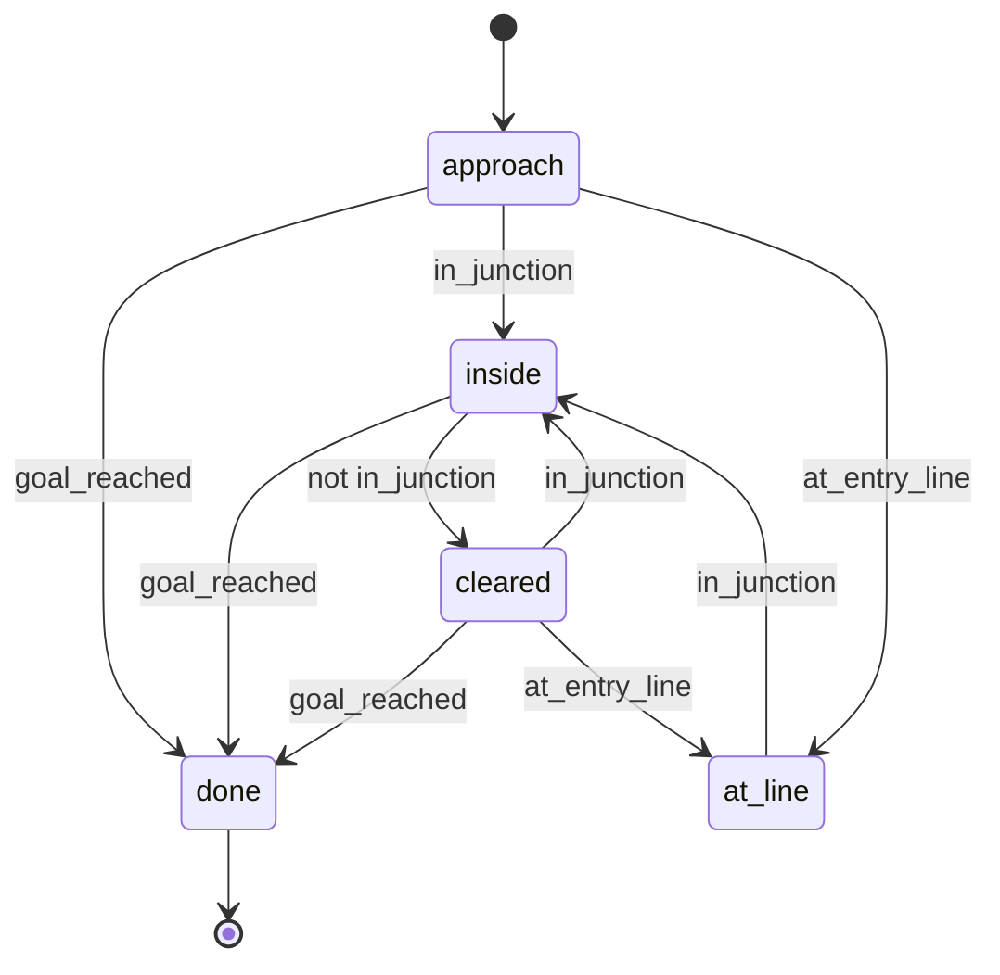
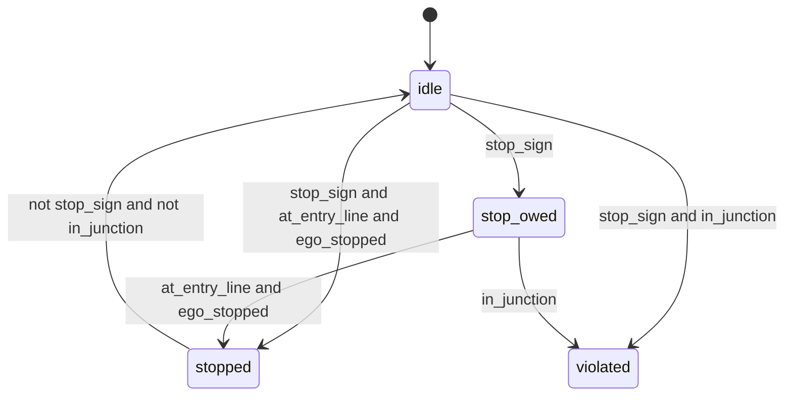
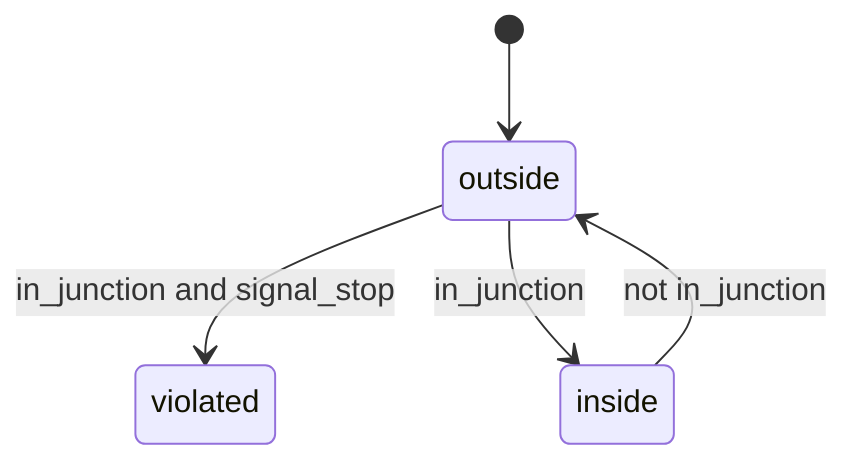
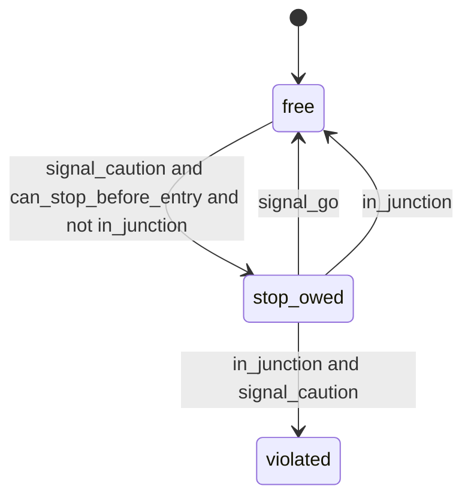
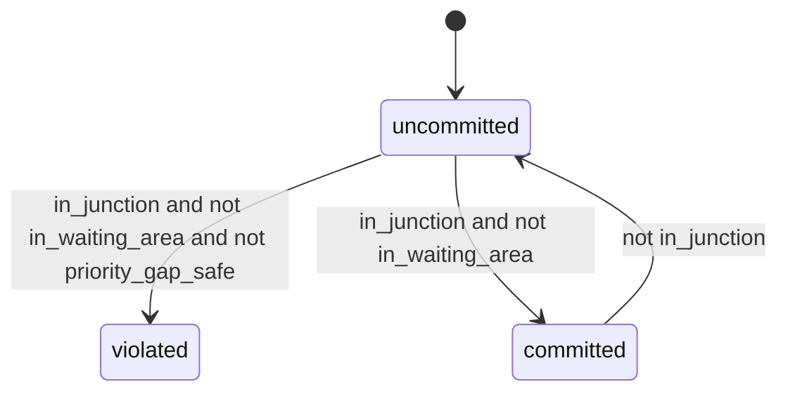
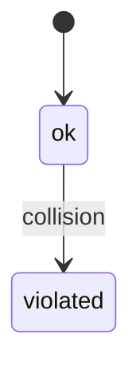
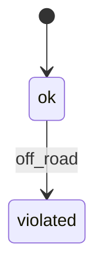
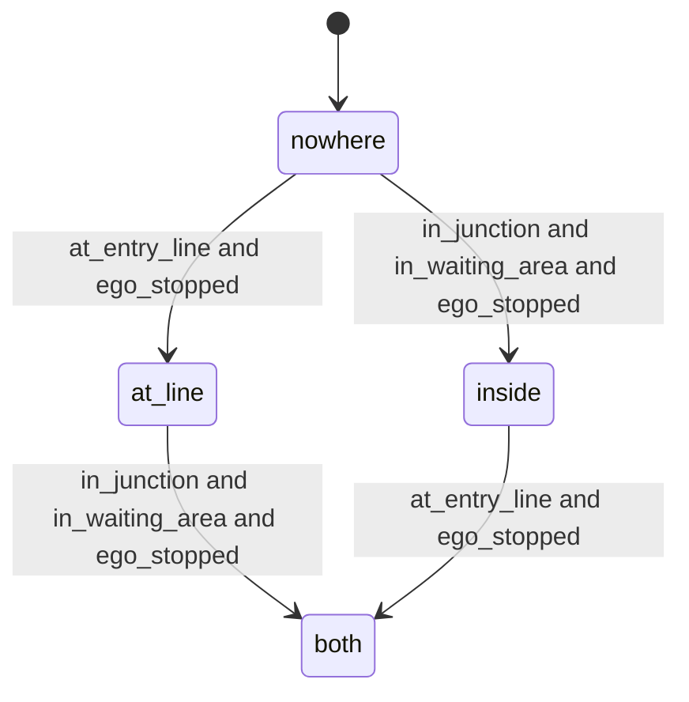

# Rule automata

Generated by `python -m semalpha.verify --docs` from `semalpha/rules.py`. Do not edit by hand.

One set of small automata judges every scenario. Each reads the label sequence of a run,
one frame at a time. None of them mentions a junction type.

- **task**: `reach_goal` tracks progress; ending in `done` means the run succeeded.
- **rule**: each watches one rule; once in `violated` it stays there.
- **branch**: `where_it_waited` records which way the ego got through.

Transitions are tried in the order listed; if none applies the automaton stays put.

## `reach_goal` (task)

Drive up to the junction, cross it, and reach the destination.

## `stop_at_stop_sign` (rule)

Where a stop sign applies, come to a halt at the line before entering.

## `obey_red_signal` (rule)

Do not enter the junction while the signal is red. Being inside when it turns red is not a violation.

## `stop_on_yellow_when_able` (rule)

If the signal is yellow while there is still room to stop, do not enter on that yellow.

## `respect_right_of_way` (rule)

Do not go past the point of no return while a car that outranks the ego is too close. Judged at the moment of committing; what happens afterwards is not held against the ego.

## `no_collision` (rule)

Never touch another car.

## `stay_on_road` (rule)

Never leave the road.

## `where_it_waited` (branch)

Records where the ego came to a halt on its way through: at the entry line, inside the junction short of anyone's path, both, or nowhere.

## Verdicts on the recorded runs

26 of 26 verdicts agree with the ones written down beforehand (the `verdict` entries in `semalpha/expectations.json`).
Runs in which a controller automaton drives are reported in [controller.md](controller.md).

| Scenario | Variant | Driver | Completed | Rules broken | Halted | Idle while free | As expected |
|---|---|---|:-:|---|---|--:|:-:|
| t_stop_left | clear | sumo | yes | none | at_line | 0.1 s | yes |
| t_stop_left | clear | roll_through | yes | `stop_at_stop_sign` at 9.7 s | nowhere | 0.0 s | yes |
| t_stop_left | wait_for_gap | sumo | yes | none | at_line | 0.2 s | yes |
| t_stop_left | wait_for_gap | enter_too_early | yes | `respect_right_of_way` at 15.1 s | at_line | 0.0 s | yes |
| t_stop_left | wait_for_gap | overcautious | yes | none | at_line | 11.2 s | yes |
| t_stop_left | gap_closes | sumo | yes | none | at_line | 0.2 s | yes |
| t_stop_left | other_turns_off | sumo | yes | `respect_right_of_way` at 11.6 s | at_line | 0.0 s | yes |
| t_stop_left | other_turns_off | wait_until_it_turns | yes | none | at_line | 0.6 s | yes |
| t_major_left | clear | sumo | yes | none | nowhere | 0.0 s | yes |
| t_major_left | oncoming_then_gap | sumo | yes | none | inside | 0.3 s | yes |
| t_major_left | oncoming_then_gap | turn_across | no | `respect_right_of_way` at 7.8 s, `no_collision` at 8.1 s | nowhere | 0.0 s | yes |
| t_major_left | oncoming_then_gap | wait_in_junction | yes | none | inside | 0.3 s | yes |
| t_major_left | minor_car_waiting | sumo | yes | none | nowhere | 0.0 s | yes |
| t_major_left | oncoming_turns_right | sumo | yes | none | inside | 0.3 s | yes |
| signal_straight | green | sumo | yes | none | nowhere | 0.0 s | yes |
| signal_straight | red_then_green | sumo | yes | none | at_line | 0.0 s | yes |
| signal_straight | red_then_green | run_red | yes | `obey_red_signal` at 41.9 s, `respect_right_of_way` at 42.2 s | nowhere | 0.0 s | yes |
| signal_straight | yellow_far | sumo | yes | none | at_line | 0.0 s | yes |
| signal_straight | yellow_near | sumo | yes | none | nowhere | 0.0 s | yes |
| signal_left | oncoming_then_gap | sumo | yes | none | inside | 0.2 s | yes |
| roundabout | empty | sumo | yes | none | nowhere | 0.0 s | yes |
| roundabout | yield_to_circulating | sumo | yes | none | at_line | 0.2 s | yes |
| roundabout | yield_to_circulating | cut_in | no | `respect_right_of_way` at 9.4 s, `no_collision` at 9.6 s | nowhere | 0.0 s | yes |
| roundabout | circulating_exits | sumo | yes | `respect_right_of_way` at 6.7 s | nowhere | 0.0 s | yes |
| roundabout | circulating_exits | wait_until_it_exits | yes | none | at_line | 0.2 s | yes |
| roundabout | entering_car_yields | sumo | yes | none | nowhere | 0.0 s | yes |

"Idle while free" is the time the ego stood still although the labels said nothing held
it. It is measured directly from the labels, not by an automaton, because it counts time.

## How far this result goes

- Runs that break each rule: `stop_at_stop_sign` 1, `obey_red_signal` 1, `stop_on_yellow_when_able` 0, `respect_right_of_way` 6, `no_collision` 2, `stay_on_road` 0.
- No run breaks `stop_on_yellow_when_able`, `stay_on_road`, so for those rules only the "no false alarm" side has been checked.
- The expected verdicts were written before the automata, but by someone who had already
  seen the label sequences. Agreement shows that one rule set separates these runs
  correctly on every junction type; it is not an independent test.
- The runs are the same ones the labels were developed on.

## Labels the rule set needs

Used (14): `at_entry_line`, `in_junction`, `in_waiting_area`, `stop_sign`, `signal_go`, `signal_caution`, `signal_stop`, `gap_safe`, `priority_gap_safe`, `ego_stopped`, `can_stop_before_entry`, `collision`, `off_road`, `goal_reached`.

Not used by any automaton (6): `approaching_junction`, `conflict_present`, `ego_has_priority`, `others_can_yield`, `path_blocked`, `exit_clear`.
