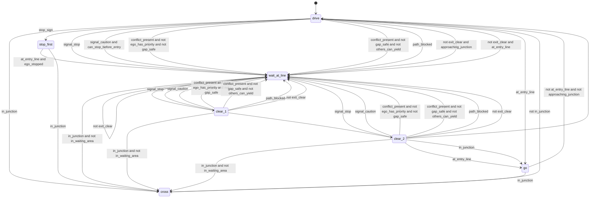

```mermaid
stateDiagram-v2
    [*] --> drive
    drive --> cross: in_junction and not in_waiting_area
    drive --> enter: in_junction
    drive --> stop_first: stop_sign
    drive --> wait_at_line: signal_stop
    drive --> wait_at_line: signal_caution and can_stop_before_entry
    drive --> wait_at_line: conflict_present and not ego_has_priority and not gap_safe
    drive --> wait_at_line: conflict_present and not gap_safe and not others_can_yield
    drive --> wait_at_line: path_blocked
    drive --> wait_at_line: not exit_clear and approaching_junction
    drive --> wait_at_line: not exit_clear and at_entry_line
    stop_first --> wait_at_line: at_entry_line and ego_stopped
    stop_first --> enter: in_junction
    wait_at_line --> cross: in_junction and not in_waiting_area
    wait_at_line --> wait_at_line: signal_stop
    wait_at_line --> wait_at_line: signal_caution
    wait_at_line --> wait_at_line: conflict_present and not ego_has_priority and not gap_safe
    wait_at_line --> wait_at_line: conflict_present and not gap_safe and not others_can_yield
    wait_at_line --> wait_at_line: path_blocked
    wait_at_line --> wait_at_line: not exit_clear
    wait_at_line --> enter: 
    enter --> cross: in_junction and not in_waiting_area
    enter --> wait_at_line: signal_stop and not in_junction
    enter --> wait_at_line: signal_caution and can_stop_before_entry and not in_junction
    enter --> wait_inside: conflict_present and not ego_has_priority and not gap_safe and in_junction
    enter --> wait_inside: conflict_present and not gap_safe and not others_can_yield and in_junction
    enter --> wait_inside: path_blocked and in_junction
    enter --> wait_at_line: conflict_present and not ego_has_priority and not gap_safe
    enter --> wait_at_line: conflict_present and not gap_safe and not others_can_yield
    enter --> wait_at_line: path_blocked
    enter --> wait_at_line: not exit_clear and not in_junction
    enter --> drive: not in_junction and not at_entry_line and not approaching_junction
    wait_inside --> cross: in_junction and not in_waiting_area
    wait_inside --> wait_inside: conflict_present and not ego_has_priority and not gap_safe
    wait_inside --> wait_inside: conflict_present and not gap_safe and not others_can_yield
    wait_inside --> wait_inside: path_blocked
    wait_inside --> enter: 
    cross --> drive: not in_junction
```

# Controller automata

Generated by `python -m semalpha.drive --docs` from `semalpha/controllers.py` and the recorded runs.
Do not edit by hand.

A controller automaton reads the labels live in the simulator and is in charge of the ego:
the action of the state it is in is what the car does. It tests whether the label alphabet
is enough to drive on, not only to judge with.

A fixed piece of code, the executor, turns an action into a speed. It knows the geometry of
the ego's own route (where the entry line is, where shared road begins, how tight the turn
is) and nothing about other traffic.

## How a run is judged

- **Passed**: the ego reached its destination and no rule automaton reported a violation.
  The rule automata read the same labels as the controller, so this shows the controller
  is consistent with the rules as the labels see them, not that it is safe.
- **From positions and speeds**: whether there was a collision, how close the ego came to
  another car, and how long the run took next to the simulator's own driver (the
  "reference") in the same traffic.
- **Cut off**: a car that had right of way over the ego braked harder than 3 m/s² within
  25 m of it while the ego was moving through the junction. This uses the map's right-of-way
  relation, but neither `gap_safe` nor any rule automaton. It is a flag to look at, not a
  verdict: a car slowing for its own turn or its own red light while the ego passes in front
  with room to spare is flagged too.

## Results at a glance

Each cell: runs passed, collisions, runs flagged for cutting a car off, and the mean time
a run took, with the simulator's own driver in the same traffic in brackets.

| Controller | Staged variants | Random traffic | Random traffic with cars ahead in the ego's lane |
|---|---|---|---|
| `dfa_v1` | 17 of 17 passed, 0 collisions; 22.2 s (20.3) | 39 of 40 passed, 0 collisions; 27.2 s (22.4) | not run |
| `dfa_v2` | 17 of 17 passed, 0 collisions; 22.4 s (20.3) | 36 of 40 passed, 2 collisions, 1 flagged; 26.3 s (22.4) | not run |
| `dfa_v3` | 17 of 17 passed, 0 collisions; 22.2 s (20.3) | 40 of 40 passed, 0 collisions; 26.6 s (22.4) | 38 of 40 passed, 1 collision, 1 flagged; 23.9 s (21.7) |

What these runs showed about the labels is written up in [design_log.md](design_log.md).

## `dfa_v1`

Stop where a stop sign says so. Hold at the line for a red or stoppable yellow signal, for a car that outranks me and is too close, or for a blocked path or exit. Otherwise go. Once past the point of no return, keep going.

| State | Action |
|---|---|
| `drive` | go |
| `stop_first` | hold at line |
| `wait_at_line` | hold at line |
| `enter` | go |
| `wait_inside` | hold inside |
| `cross` | go |

Transitions are tried in the order written. A transition back to the same state means
"stay while this holds"; an empty condition means "otherwise".



Labels it reads: `approaching_junction`, `at_entry_line`, `can_stop_before_entry`, `conflict_present`, `ego_has_priority`, `ego_stopped`, `exit_clear`, `gap_safe`, `in_junction`, `in_waiting_area`, `others_can_yield`, `path_blocked`, `signal_caution`, `signal_stop`, `stop_sign`.

### `dfa_v1` on the staged variants

17 of 17 passed (reached the destination, no rule broken); 0 collisions; 0 flagged for cutting another car off.

| Scenario | Variant | Passed | Rules broken | Halted | Time (reference) | Closest car | Collision | Cars cut off |
|---|---|:-:|---|---|--:|--:|:-:|---|
| t_stop_left | clear | yes | none | at_line | 20.2 s (18.5) | none | no | none |
| t_stop_left | wait_for_gap | yes | none | at_line | 24.1 s (23.7) | 8.3 m | no | none |
| t_stop_left | gap_closes | yes | none | at_line | 25.0 s (24.7) | 8.3 m | no | none |
| t_stop_left | other_turns_off | yes | none | at_line | 21.8 s (18.5) | 3.3 m | no | none |
| t_major_left | clear | yes | none | nowhere | 18.4 s (15.9) | none | no | none |
| t_major_left | oncoming_then_gap | yes | none | at_line | 22.9 s (21.7) | 3.2 m | no | none |
| t_major_left | minor_car_waiting | yes | none | inside | 20.2 s (15.9) | 9.0 m | no | none |
| t_major_left | oncoming_turns_right | yes | none | at_line | 22.3 s (21.0) | 14.1 m | no | none |
| signal_straight | green | yes | none | nowhere | 12.9 s (11.3) | none | no | none |
| signal_straight | red_then_green | yes | none | at_line | 22.3 s (22.7) | 9.1 m | no | none |
| signal_straight | yellow_far | yes | none | at_line | 40.2 s (40.7) | none | no | none |
| signal_straight | yellow_near | yes | none | nowhere | 12.9 s (11.3) | none | no | none |
| signal_left | oncoming_then_gap | yes | none | at_line | 18.2 s (17.5) | 3.2 m | no | none |
| roundabout | empty | yes | none | nowhere | 22.5 s (19.1) | none | no | none |
| roundabout | yield_to_circulating | yes | none | at_line | 25.8 s (24.3) | 7.8 m | no | none |
| roundabout | circulating_exits | yes | none | at_line | 25.2 s (19.1) | 3.4 m | no | none |
| roundabout | entering_car_yields | yes | none | nowhere | 22.5 s (19.1) | 16.0 m | no | none |

### `dfa_v1` in random traffic

Each draw places 2 to 6 cars on random routes, departing around the time the ego arrives; at the signal the ego also arrives at a random point of the cycle. The draws are reproducible, and the labels were not developed on any of them.

39 of 40 passed (reached the destination, no rule broken); 0 collisions; 0 flagged for cutting another car off.

| Scenario | Passed | Collisions | Cut another car off | Mean time (reference) |
|---|:-:|:-:|:-:|--:|
| t_stop_left | 8 of 8 | 0 | 0 | 27.9 s (26.2) |
| t_major_left | 8 of 8 | 0 | 0 | 25.9 s (22.3) |
| signal_straight | 8 of 8 | 0 | 0 | 23.2 s (22.9) |
| signal_left | 8 of 8 | 0 | 0 | 29.7 s (21.2) |
| roundabout | 7 of 8 | 0 | 0 | 29.2 s (19.1) |

The draws that failed or were flagged:

| Scenario | Variant | Passed | Rules broken | Halted | Time (reference) | Closest car | Collision | Cars cut off |
|---|---|:-:|---|---|--:|--:|:-:|---|
| roundabout | random_06 | **no** | `respect_right_of_way` at 18.2 s | both | 33.3 s (19.1) | 12.6 m | no | none |

## `dfa_v2`

As dfa_v1, but steadier: it leaves the line only after three frames in a row without a reason to hold, it makes that decision at the line, and once it has moved off it does not stop again inside the junction.

| State | Action |
|---|---|
| `drive` | go |
| `stop_first` | hold at line |
| `wait_at_line` | hold at line |
| `clear_1` | hold at line |
| `clear_2` | hold at line |
| `go` | go |
| `cross` | go |

Transitions are tried in the order written. A transition back to the same state means
"stay while this holds"; an empty condition means "otherwise".



Labels it reads: `approaching_junction`, `at_entry_line`, `can_stop_before_entry`, `conflict_present`, `ego_has_priority`, `ego_stopped`, `exit_clear`, `gap_safe`, `in_junction`, `in_waiting_area`, `others_can_yield`, `path_blocked`, `signal_caution`, `signal_stop`, `stop_sign`.

### `dfa_v2` on the staged variants

17 of 17 passed (reached the destination, no rule broken); 0 collisions; 0 flagged for cutting another car off.

| Scenario | Variant | Passed | Rules broken | Halted | Time (reference) | Closest car | Collision | Cars cut off |
|---|---|:-:|---|---|--:|--:|:-:|---|
| t_stop_left | clear | yes | none | at_line | 20.4 s (18.5) | none | no | none |
| t_stop_left | wait_for_gap | yes | none | at_line | 24.2 s (23.7) | 8.3 m | no | none |
| t_stop_left | gap_closes | yes | none | at_line | 25.3 s (24.7) | 8.3 m | no | none |
| t_stop_left | other_turns_off | yes | none | at_line | 22.0 s (18.5) | 3.2 m | no | none |
| t_major_left | clear | yes | none | nowhere | 18.4 s (15.9) | none | no | none |
| t_major_left | oncoming_then_gap | yes | none | at_line | 23.1 s (21.7) | 3.2 m | no | none |
| t_major_left | minor_car_waiting | yes | none | inside | 20.4 s (15.9) | 9.0 m | no | none |
| t_major_left | oncoming_turns_right | yes | none | at_line | 22.6 s (21.0) | 14.2 m | no | none |
| signal_straight | green | yes | none | nowhere | 12.9 s (11.3) | none | no | none |
| signal_straight | red_then_green | yes | none | at_line | 22.4 s (22.7) | 9.1 m | no | none |
| signal_straight | yellow_far | yes | none | at_line | 40.4 s (40.7) | none | no | none |
| signal_straight | yellow_near | yes | none | nowhere | 12.9 s (11.3) | none | no | none |
| signal_left | oncoming_then_gap | yes | none | at_line | 18.5 s (17.5) | 3.2 m | no | none |
| roundabout | empty | yes | none | nowhere | 22.5 s (19.1) | none | no | none |
| roundabout | yield_to_circulating | yes | none | at_line | 26.1 s (24.3) | 7.8 m | no | none |
| roundabout | circulating_exits | yes | none | at_line | 25.5 s (19.1) | 3.3 m | no | none |
| roundabout | entering_car_yields | yes | none | nowhere | 22.5 s (19.1) | 16.0 m | no | none |

### `dfa_v2` in random traffic

Each draw places 2 to 6 cars on random routes, departing around the time the ego arrives; at the signal the ego also arrives at a random point of the cycle. The draws are reproducible, and the labels were not developed on any of them.

36 of 40 passed (reached the destination, no rule broken); 2 collisions; 1 flagged for cutting another car off.

| Scenario | Passed | Collisions | Cut another car off | Mean time (reference) |
|---|:-:|:-:|:-:|--:|
| t_stop_left | 6 of 8 | 2 | 0 | 24.9 s (26.2) |
| t_major_left | 7 of 8 | 0 | 0 | 25.7 s (22.3) |
| signal_straight | 8 of 8 | 0 | 0 | 23.3 s (22.9) |
| signal_left | 7 of 8 | 0 | 1 | 29.5 s (21.2) |
| roundabout | 8 of 8 | 0 | 0 | 28.3 s (19.1) |

The draws that failed or were flagged:

| Scenario | Variant | Passed | Rules broken | Halted | Time (reference) | Closest car | Collision | Cars cut off |
|---|---|:-:|---|---|--:|--:|:-:|---|
| t_stop_left | random_02 | **no** | `respect_right_of_way` at 18.1 s, `no_collision` at 18.4 s | at_line | 18.2 s (27.6) | 3.1 m | **yes** | none |
| t_stop_left | random_06 | **no** | `respect_right_of_way` at 16.7 s, `no_collision` at 17.0 s | at_line | 16.8 s (31.7) | 3.1 m | **yes** | none |
| t_major_left | random_06 | **no** | `respect_right_of_way` at 7.7 s | nowhere | 18.4 s (15.9) | 3.1 m | no | none |
| signal_left | random_05 | **no** | `respect_right_of_way` at 52.2 s | at_line | 40.1 s (39.3) | 4.7 m | no | car_5 |

## `dfa_v3`

As dfa_v1, with two changes. 'A car that outranks me is too close' is read from the label priority_gap_safe, so that both halves of it are about the same car. And while crossing, it brakes if a car that should give way can no longer stop.

| State | Action |
|---|---|
| `drive` | go |
| `stop_first` | hold at line |
| `wait_at_line` | hold at line |
| `enter` | go |
| `wait_inside` | hold inside |
| `cross` | go |
| `avoid` | stop |

Transitions are tried in the order written. A transition back to the same state means
"stay while this holds"; an empty condition means "otherwise".

```mermaid
stateDiagram-v2
    [*] --> drive
    drive --> cross: in_junction and not in_waiting_area
    drive --> enter: in_junction
    drive --> stop_first: stop_sign
    drive --> wait_at_line: signal_stop
    drive --> wait_at_line: signal_caution and can_stop_before_entry
    drive --> wait_at_line: not priority_gap_safe
    drive --> wait_at_line: conflict_present and not gap_safe and not others_can_yield
    drive --> wait_at_line: path_blocked
    drive --> wait_at_line: not exit_clear and approaching_junction
    drive --> wait_at_line: not exit_clear and at_entry_line
    stop_first --> wait_at_line: at_entry_line and ego_stopped
    stop_first --> enter: in_junction
    wait_at_line --> cross: in_junction and not in_waiting_area
    wait_at_line --> wait_at_line: signal_stop
    wait_at_line --> wait_at_line: signal_caution
    wait_at_line --> wait_at_line: not priority_gap_safe
    wait_at_line --> wait_at_line: conflict_present and not gap_safe and not others_can_yield
    wait_at_line --> wait_at_line: path_blocked
    wait_at_line --> wait_at_line: not exit_clear
    wait_at_line --> enter: 
    enter --> cross: in_junction and not in_waiting_area
    enter --> wait_at_line: signal_stop and not in_junction
    enter --> wait_at_line: signal_caution and can_stop_before_entry and not in_junction
    enter --> wait_inside: not priority_gap_safe and in_junction
    enter --> wait_inside: conflict_present and not gap_safe and not others_can_yield and in_junction
    enter --> wait_inside: path_blocked and in_junction
    enter --> wait_at_line: not priority_gap_safe
    enter --> wait_at_line: conflict_present and not gap_safe and not others_can_yield
    enter --> wait_at_line: path_blocked
    enter --> wait_at_line: not exit_clear and not in_junction
    enter --> drive: not in_junction and not at_entry_line and not approaching_junction
    wait_inside --> cross: in_junction and not in_waiting_area
    wait_inside --> wait_inside: not priority_gap_safe
    wait_inside --> wait_inside: conflict_present and not gap_safe and not others_can_yield
    wait_inside --> wait_inside: path_blocked
    wait_inside --> enter: 
    cross --> drive: not in_junction
    cross --> avoid: conflict_present and not gap_safe and not others_can_yield
    avoid --> drive: not in_junction
    avoid --> avoid: conflict_present and not gap_safe and not others_can_yield
    avoid --> cross: 
```

Labels it reads: `approaching_junction`, `at_entry_line`, `can_stop_before_entry`, `conflict_present`, `ego_stopped`, `exit_clear`, `gap_safe`, `in_junction`, `in_waiting_area`, `others_can_yield`, `path_blocked`, `priority_gap_safe`, `signal_caution`, `signal_stop`, `stop_sign`.

### `dfa_v3` on the staged variants

17 of 17 passed (reached the destination, no rule broken); 0 collisions; 0 flagged for cutting another car off.

| Scenario | Variant | Passed | Rules broken | Halted | Time (reference) | Closest car | Collision | Cars cut off |
|---|---|:-:|---|---|--:|--:|:-:|---|
| t_stop_left | clear | yes | none | at_line | 20.2 s (18.5) | none | no | none |
| t_stop_left | wait_for_gap | yes | none | at_line | 24.1 s (23.7) | 8.3 m | no | none |
| t_stop_left | gap_closes | yes | none | at_line | 25.0 s (24.7) | 8.3 m | no | none |
| t_stop_left | other_turns_off | yes | none | at_line | 21.8 s (18.5) | 3.3 m | no | none |
| t_major_left | clear | yes | none | nowhere | 18.4 s (15.9) | none | no | none |
| t_major_left | oncoming_then_gap | yes | none | at_line | 22.9 s (21.7) | 3.2 m | no | none |
| t_major_left | minor_car_waiting | yes | none | inside | 20.2 s (15.9) | 9.0 m | no | none |
| t_major_left | oncoming_turns_right | yes | none | at_line | 22.3 s (21.0) | 14.1 m | no | none |
| signal_straight | green | yes | none | nowhere | 12.9 s (11.3) | none | no | none |
| signal_straight | red_then_green | yes | none | at_line | 22.3 s (22.7) | 9.1 m | no | none |
| signal_straight | yellow_far | yes | none | at_line | 40.2 s (40.7) | none | no | none |
| signal_straight | yellow_near | yes | none | nowhere | 12.9 s (11.3) | none | no | none |
| signal_left | oncoming_then_gap | yes | none | at_line | 18.2 s (17.5) | 3.2 m | no | none |
| roundabout | empty | yes | none | nowhere | 22.5 s (19.1) | none | no | none |
| roundabout | yield_to_circulating | yes | none | at_line | 25.8 s (24.3) | 7.8 m | no | none |
| roundabout | circulating_exits | yes | none | at_line | 25.2 s (19.1) | 3.4 m | no | none |
| roundabout | entering_car_yields | yes | none | nowhere | 23.0 s (19.1) | 18.3 m | no | none |

### `dfa_v3` in random traffic

Each draw places 2 to 6 cars on random routes, departing around the time the ego arrives; at the signal the ego also arrives at a random point of the cycle. The draws are reproducible, and the labels were not developed on any of them.

40 of 40 passed (reached the destination, no rule broken); 0 collisions; 0 flagged for cutting another car off.

| Scenario | Passed | Collisions | Cut another car off | Mean time (reference) |
|---|:-:|:-:|:-:|--:|
| t_stop_left | 8 of 8 | 0 | 0 | 27.9 s (26.2) |
| t_major_left | 8 of 8 | 0 | 0 | 25.8 s (22.3) |
| signal_straight | 8 of 8 | 0 | 0 | 23.4 s (22.9) |
| signal_left | 8 of 8 | 0 | 0 | 29.5 s (21.2) |
| roundabout | 8 of 8 | 0 | 0 | 26.2 s (19.1) |

### `dfa_v3` in random traffic with cars ahead in the ego's lane

Each draw places 2 to 6 cars on random routes, departing around the time the ego arrives; at the signal the ego also arrives at a random point of the cycle. Here a car may also start ahead of the ego in its own lane. The draws are reproducible, and the labels were not developed on any of them.

38 of 40 passed (reached the destination, no rule broken); 1 collision; 1 flagged for cutting another car off.

| Scenario | Passed | Collisions | Cut another car off | Mean time (reference) |
|---|:-:|:-:|:-:|--:|
| t_stop_left | 8 of 8 | 0 | 0 | 27.2 s (25.1) |
| t_major_left | 8 of 8 | 0 | 0 | 19.4 s (17.2) |
| signal_straight | 8 of 8 | 0 | 0 | 21.8 s (21.2) |
| signal_left | 6 of 8 | 1 | 1 | 23.7 s (25.9) |
| roundabout | 8 of 8 | 0 | 0 | 27.5 s (19.1) |

The draws that failed or were flagged:

| Scenario | Variant | Passed | Rules broken | Halted | Time (reference) | Closest car | Collision | Cars cut off |
|---|---|:-:|---|---|--:|--:|:-:|---|
| signal_left | random_L01 | **no** | `respect_right_of_way` at 23.1 s | nowhere | 15.0 s (42.6) | 3.3 m | no | car_2 |
| signal_left | random_L05 | **no** | `no_collision` at 51.0 s | nowhere | 6.3 s (16.1) | 3.7 m | **yes** | none |

## Limits

- **Passing is not proof of safety.** The controller and the rule automata read the same
  labels. Collisions, distances, times and the cut-off flag are the independent part.
- **Background cars usually brake for the ego**, which can hide a mistake; the cut-off flag
  is there to expose that. They do not always give way to it where they should.
- **No label describes a car ahead in the ego's own lane**, so no controller can follow or
  queue behind one.
- **Holding is not exact.** Told to stand still just before or inside a bend, the simulated
  car creeps forward by about 0.1 m/s.
- **Small sample.** Eight draws per scenario, three maps, one lane per direction, perfect
  perception.
